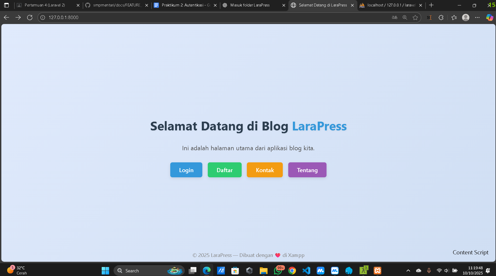
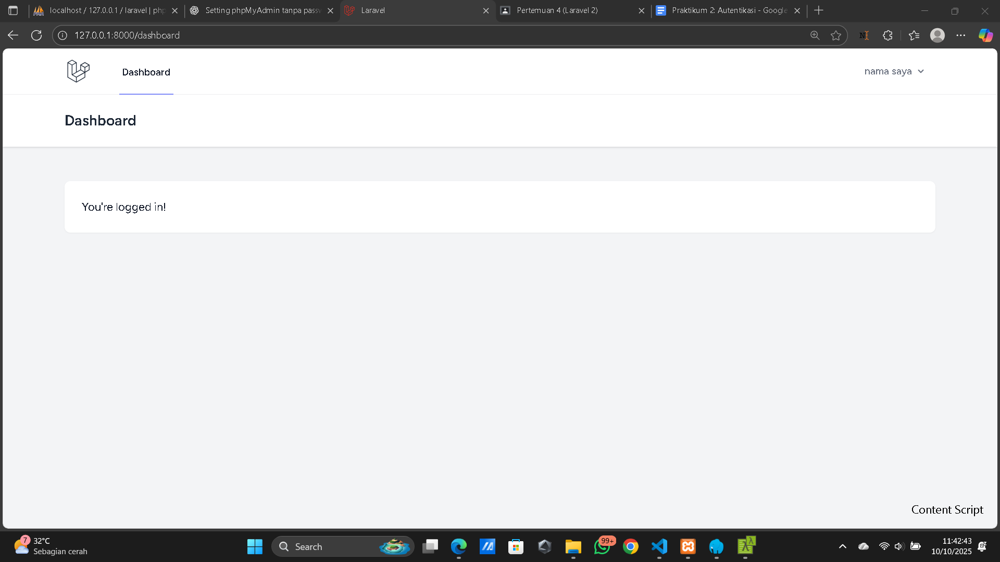
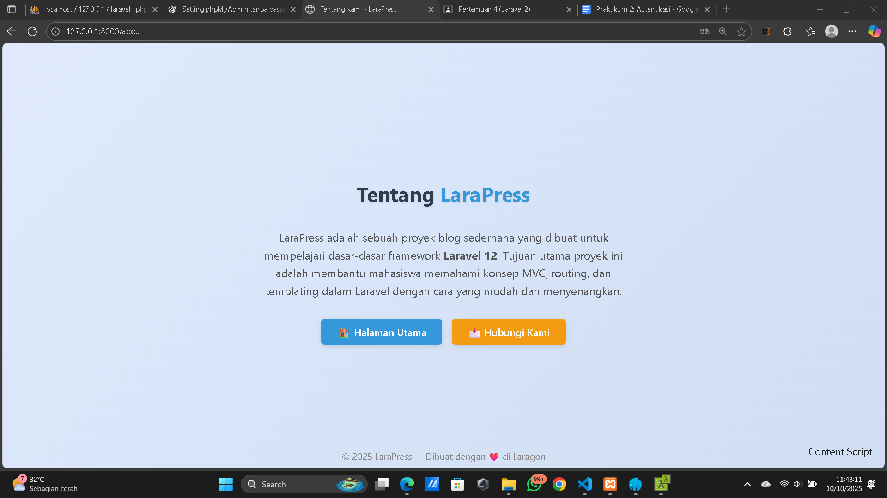
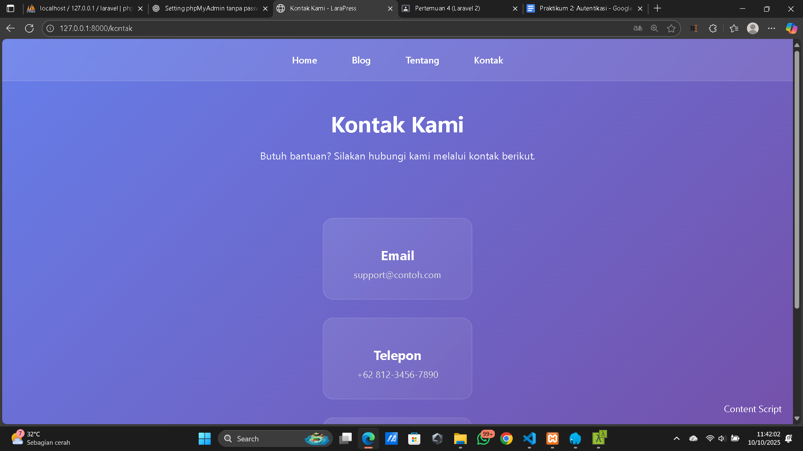

# Praktikum Laravel - Pertemuan 3
**Judul:** Instalasi dan Implementasi Laravel Breeze (Sistem Autentikasi) 
**Proyek:** LaraPress (Blog Sederhana)  

---

## Tujuan
- Memasang dan mengonfigurasi paket Laravel Breeze pada proyek LaraPress
- Memahami konsep dasar autentikasi pengguna (login & register) di Laravel
- Menjalankan perintah migrasi database untuk tabel user
- Mengelola dependensi frontend menggunakan NPM dan Vite
- Meningkatkan tampilan halaman dengan CSS sederhana dan responsif 

---

## Alat yang Dibutuhkan
- Xampp (server lokal dan database MySQL)
- Composer (dependency manager PHP)
- Node.js & NPM (untuk kompilasi aset frontend)
- Terminal bawaan Laragon / CMD / PowerShell
- VS Code (code editor)
- Browser (Chrome / Firefox)

---

## Hasil dan Output

Aplikasi LaraPress kini memiliki sistem login dan register yang berfungsi dengan baik.
Desain halaman awal telah diperindah dengan CSS bergaya modern.
Struktur autentikasi siap digunakan untuk fitur lanjutan seperti otorisasi dan manajemen pengguna.

## Welcome

## Dashboard

## About

## Kontak

## Kesimpulan

Pada pertemuan ini, kita telah berhasil menambahkan sistem autentikasi yang lengkap dan aman ke dalam aplikasi LaraPress.
Kita tidak hanya belajar cara menginstal Laravel Breeze, tetapi juga memahami konsep fundamental di baliknya.
Kini aplikasi kita siap untuk fitur selanjutnya: otorisasi, di mana kita akan mengatur hak akses spesifik untuk setiap pengguna.